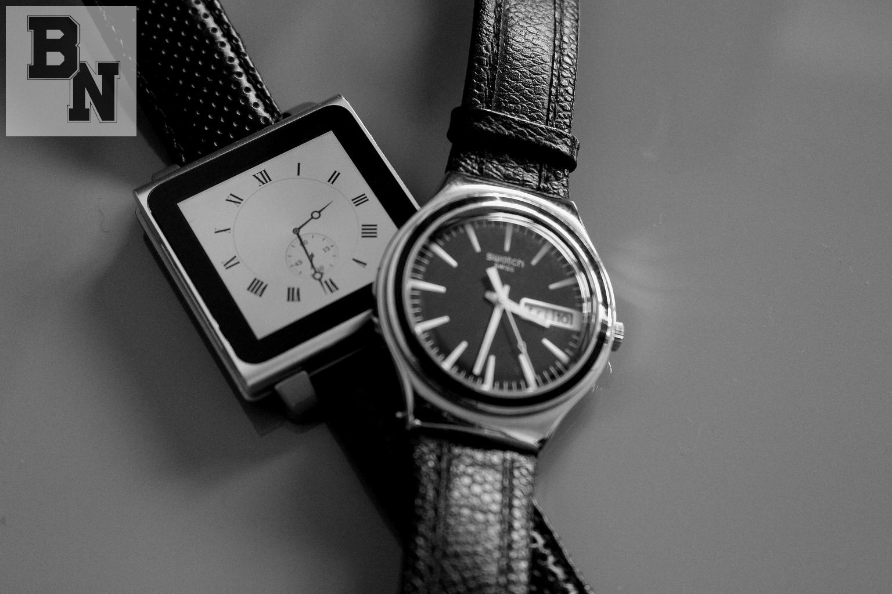
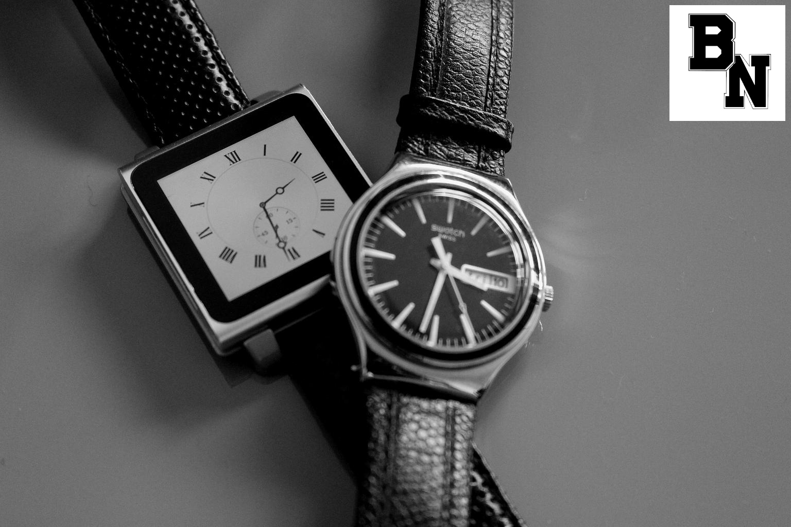
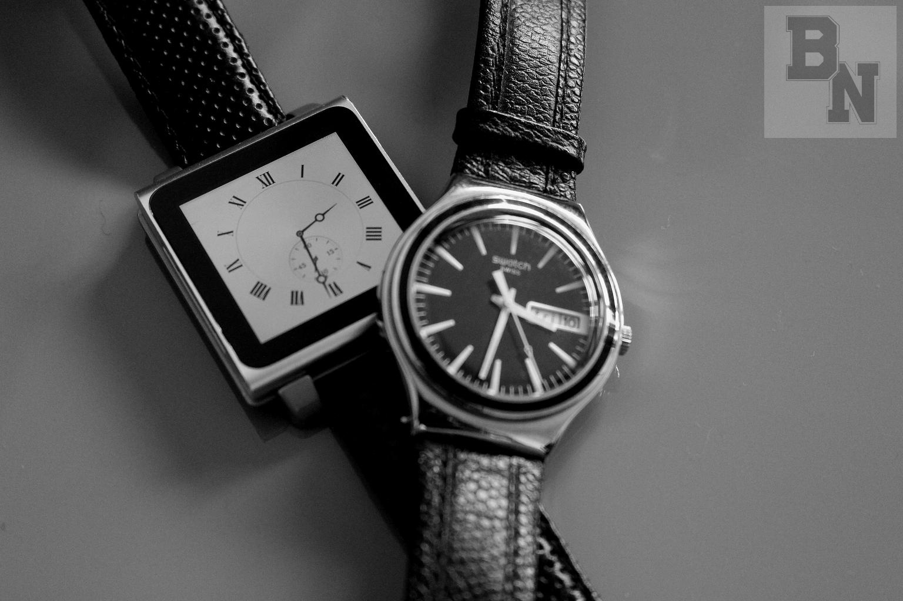

#   Image Blending

### Purpose:
To illustrate blending images.
Using a blending algorithm and adding an alpha channel to an image one can blend a smaller image on top of a larger image
The X and Y coordinates can be any coordinates whether they make it on or off the background image though the Alpha needs
 to be in range of 0 to 1. 0 being no transparency and 1 being full transparency.
  - How to Use:
   
        - python main.py -i <image-name> -l <logo> -x <x> -y <y> -a <alpha>
        - Example: python main.py -i watches.jpg -l myLogo.png -x 10 -y 10 -a 0.5
        
### Example: X:10 Y:10 Alpha:0

### Example: X:10 Y:10 Alpha 0.5

### Example: X:1300 Y:10 Alpha 0.0

### Example: X:1300 Y:10 Alpha 0.8

